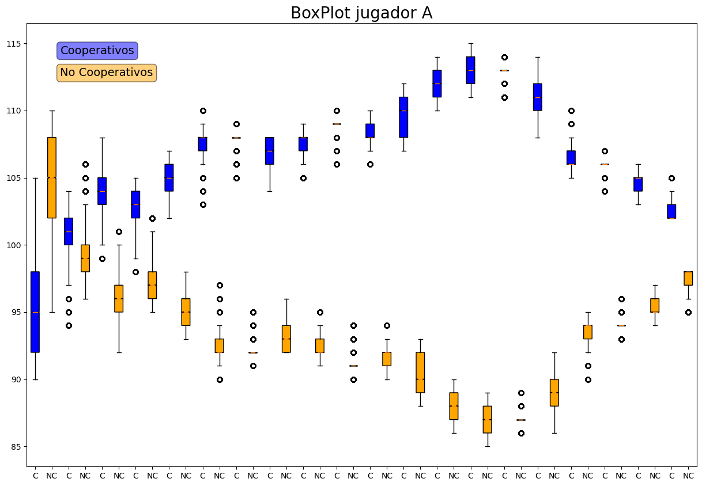

# Game-Theory

The repository contains a collection of Python scripts that implement various game theory models and strategies, along with a set of payoff matrices for users to experiment with. To use the repository, users must first install the required dependencies by running the following command in the terminal: 

```
pip install -r requirements.txt
``` 

Additionally, users must also have Julia installed on their system, as some of the scripts use Julia code for certain calculations.


